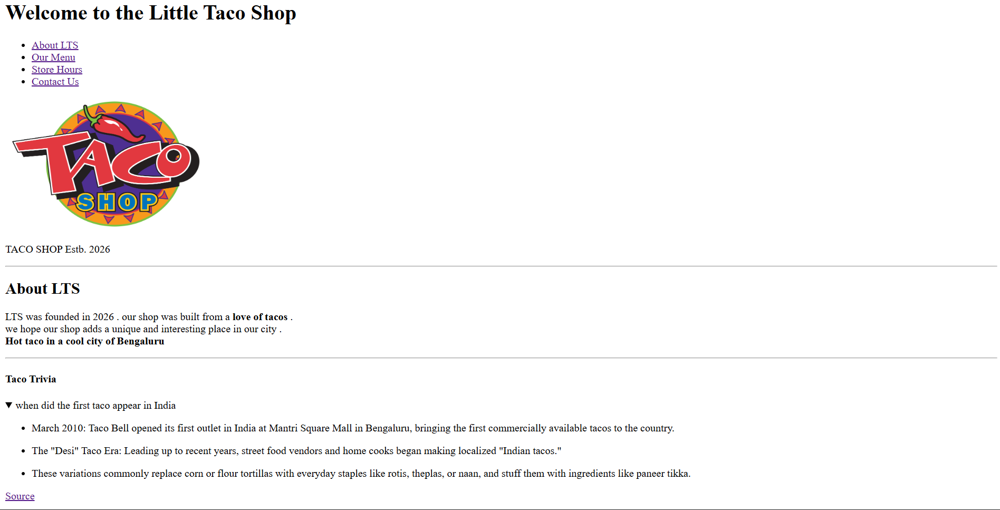
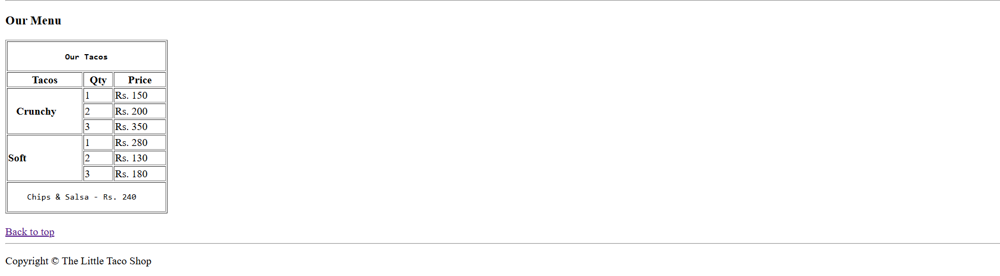
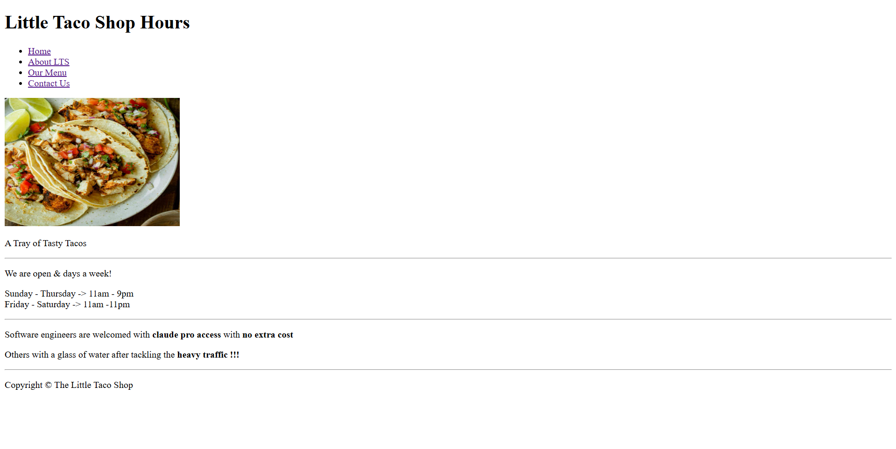
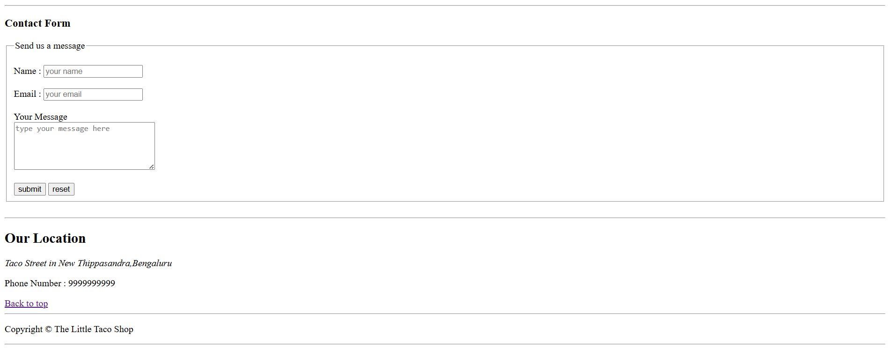

## Little Taco Shop 

-Done purely using HTML 
-Uses some of the common tags and attributes of HTML5

## Features

- Multi Page website (used anchor tag)
- Navigation to a different section of the same page
- Uses form for feedback from the user
- Table to display the shop menu (used `rowspan` and colspan `attributes`)
- Displayed some images to make the website look attractive

## Preview

### Home Page

### Hours Page

### Contact Page

